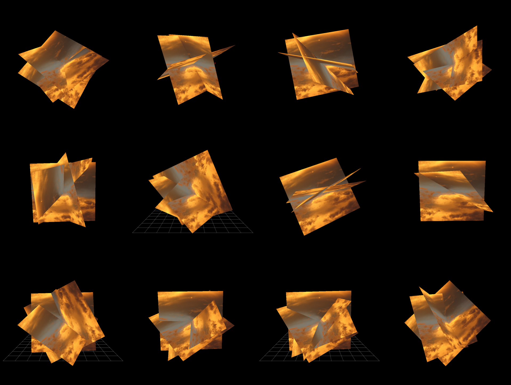

### Plane Intersections

This graphicsy play-space is is on the same theme of the `CollageTool` but uses the code of the `3D_PCA` for the perspective projection. The idea is just to make some virtual objects and spaces out of fragments of digital images.

I still can't shake the idea that there's something in this reprojection and collaging of digital images, more so after following some of Vi Hart's VR work.

This is an Eclipse Processing3 project which means:

[Processing in Eclipse](https://processing.org/tutorials/eclipse/)

**Stuff**

* Do this graphics stuff properly- probably the depth sorting implementation is, er, not great
* Best way to start using the GPU? It's all pretty slow at the moment
* Refactor this. Pretty messy at the moment.
* Plane/plain pun. Not great.

And some *Links*:

* [Extracts of Local Distance](http://www.feld.is/projects/local-distance/)
* [Vi Hart](http://vihart.com/)
* Math for 3D Game Programming and Computer Graphics - Eric Lengyel